# 📊 Sales Data Cleaning & ETL Pipeline (Excel Power Query)

**Built with:** Microsoft Excel • Power Query (M Language)

<p align="center">
  <a href="screenshots/final_etl_output_result.jpeg"></a>
</p>

---

## Project Summary

This project transforms **messy, unformatted sales data**—plagued by inconsistent text, incorrect data types, missing values, duplicate records, and inefficient spreadsheet layouts—into **clean, structured, analysis-ready tables** using Excel's Power Query (M Language).

In plain terms, this repository demonstrates an end-to-end **ETL (Extract, Transform, Load) pipeline**:
* **Extract & Clean:** Processed the primary `sales_flattable.csv` dataset to resolve underlying data quality issues.
* **Transform & Model:** Structured the cleaned data into a production-ready **Star Schema** (Fact and Dimension tables)—the standard architecture used to power enterprise dashboards and BI reports.
* **Extended ETL Skills:** Demonstrated real-world handling of multi-file data appending (`orders_jan` & `orders_feb`) and wide-to-tall data reshaping (`sales_monthly`) as standalone demonstration steps.

> *This project was completed by following the "Power Query Master Class for Power BI" tutorial by data engineer Baraa Khatib Salkini (Data With Baraa). A huge thank you to him for putting together such a practical, hands-on course*

**What this project demonstrates:**
- Cleaning dirty text (extra spaces, wrong casing, weird characters)
- Fixing broken data types (text that should be dates and numbers)
- Making deliberate, business-informed decisions about missing data — instead of just guessing or deleting it
- Splitting, merging, and extracting information out of messy columns
- Combining multiple data sources correctly (Merging vs. Appending) and catching duplicates
- Demonstration of reshaping data with Unpivot and Pivot so it's ready for reporting
- Organizing queries the way a real analyst would — using references, a Fact/Dimension model, and tidy folders

---

## Table of Contents

- [Project Summary](#project-summary)
- [Repository Structure](#repository-structure)
- [ETL Phases Breakdown](#etl-phases-breakdown)
  - [Phase 1: Connect the Data](#phase-1-connect-the-data)
  - [Phase 2: Filter Out unnecessary data](#phase-2-filter-out-the-noise)
  - [Phase 3: Clean the Data](#phase-3-clean-the-data)
  - [Phase 4: Transform the Data](#phase-4-transform-the-data)
  - [Phase 5: Combine the Data](#phase-5-combine-the-data)
  - [Phase 6: Final Cleanup and Housekeeping](#phase-6-final-cleanup-and-housekeeping)
- [Credits and Acknowledgments](#credits-and-acknowledgments)

---

## Repository Structure

```
(repository root)
├── datasets/
│   ├── orders_feb.csv
│   ├── orders_jan.csv
│   ├── sales_flattable.csv
│   └── sales_monthly.csv
│
├── screenshots/
│   ├── 01_data_cleaning/
│   ├── 02_data_transformation/
│   ├── 03_combine_data/
│   └── 04_cleaning_up_and_housekeeping/
│
├── PowerQuery_Sales_Data_Cleaning_and_ETL_Pipeline.xlsx
└── README.md
```

---

## ETL Phases Breakdown

### Phase 1: Connect the Data
The first step of any Power Query project is simply getting the data in front of you. I connected Power Query to sales_flattable.csv file so I could start working with that file.

### Phase 2: Filter Out the unnecessary data
Before doing any deep cleaning, I did a first pass to remove unnecessary data which is not valuable for reporting later:
- Removed **blank rows**
- Removed **unnecessary columns** that added no business value (for example, internal tracking columns like `Technical_Log_ID`)

**A note on scope:** it's also possible to filter data down to a specific time period (for example, "only look at last year's sales"). That decision should come from talking to business managers about what timeframe actually matters for their analysis. For this project, no timeframe filtering was applied — all available data was kept.

---

### Phase 3: Clean the Data

#### Step 1: Standardizing Every Column
For every column in the table, I checked it against the same four issues:
1. **Data type** — is it stored as the right type (text, number, date)?
2. **Evil whitespace** — are there hidden spaces sneaking into the values?
3. **Text casing** — is the capitalization consistent?
4. **Weird characters** — are there stray symbols making the data "dirty"?

Only columns that actually had a problem were touched. Any issue is missing from steps of this phase below was already fine (you can verify this yourself in the attached Excel file and raw datasets).

- **Removed duplicate rows** from `sales_flattable` as a first-pass cleanup.

**Product Info Column**

**The Problem:** A hidden blank row was increasing the length of column than it should be.
**What I Did:** Before touching anything, I compared the character length of the values before and after a test trim — that comparison confirmed hidden whitespace was present. I then removed my test steps, went back to the original column, and applied the trim properly.

<p align="center">
  <a href="screenshots/01_data_cleaning/01_product_info/product_info_trim_length_check.jpeg">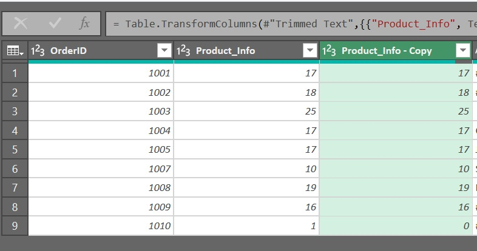</a>
  <br><em>Length check used to confirm hidden whitespace before trimming</em>
</p>

**Customer Names (First Name & Last Name)**

**The Problem:** Names had inconsistent spacing, inconsistent capitalization, and weird characters (like a `#` in front of some first names).
**What I Did:** Trimmed extra spaces, capitalized each word properly, and replaced weird characters with blank on the First_Name column. Trimmed and re-capitalized the Last Name_column.

| ❌ Before Cleaning | ✅ After Cleaning |
| :---: | :---: |
| <a href="screenshots/01_data_cleaning/02_customer_names/01_customer_names_before_cleaning.jpeg">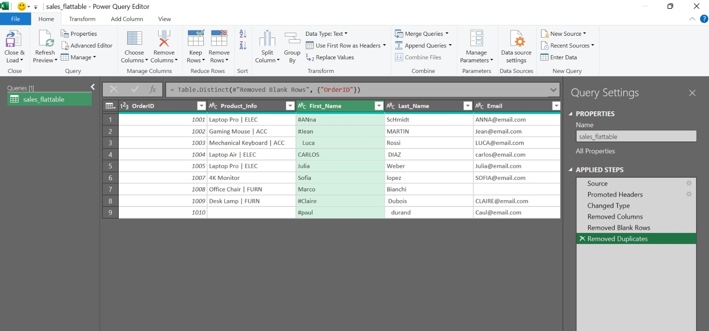</a> | <a href="screenshots/01_data_cleaning/02_customer_names/02_customer_names_after_cleaning.jpeg">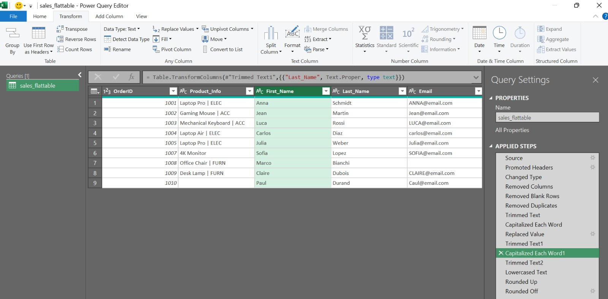</a> |

**Email Column**

**The Problem:** Emails had inconsistent casing and hidden whitespace.
**What I Did:** Same length-comparison trick used on Product_Info column to confirm hidden whitespace, then removed it and lowercased every email for consistency.

<p align="center">
  <a href="screenshots/01_data_cleaning/03_email_addresses/01_email_length_comparison.jpeg">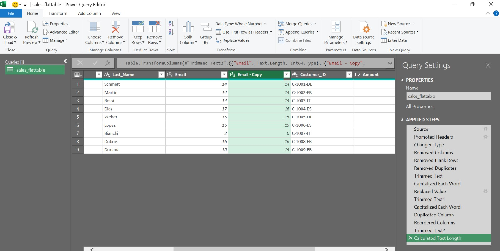</a>
  <br><em>Length comparison used to confirm hidden whitespace before trimming</em>
</p>

| ❌ Before Cleaning | ✅ After Cleaning |
| :---: | :---: |
| <a href="screenshots/01_data_cleaning/03_email_addresses/02_email_before_cleaning.jpeg">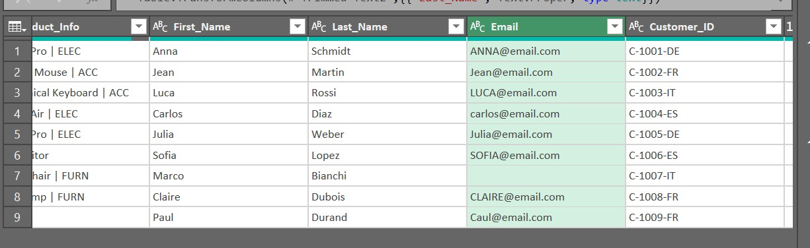</a> | <a href="screenshots/01_data_cleaning/03_email_addresses/03_email_after_cleaning.jpeg">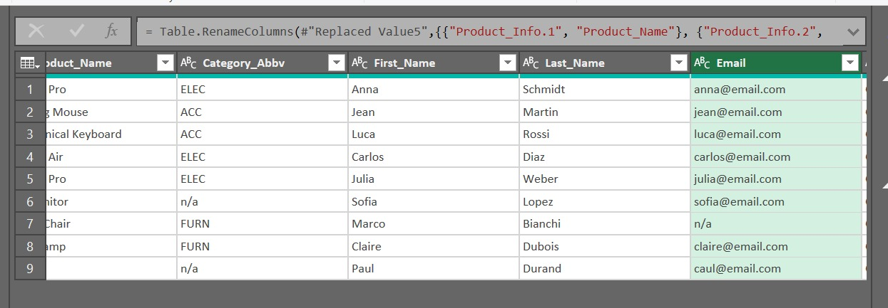</a> |

**Customer ID Column**

Checked against all four standardizing rules — no issues found. No cleaning needed.

**Numeric Columns: Amount & Price**

**The Problem:** `Amount` represents the quantity a customer ordered, so it shouldn't have decimal points. `Price` was carrying more decimal precision than the business actually needed.
**What I Did:** Rounded `Amount` to whole numbers (Power Query automatically switched its data type from decimal to whole number afterward). Rounded `Price` to one decimal place, per the business's instructions.

| ❌ Before Rounding | ✅ After Rounding |
| :---: | :---: |
| <a href="screenshots/01_data_cleaning/05_financials_amount_and_price/01_amount_price_before_rounding.jpeg">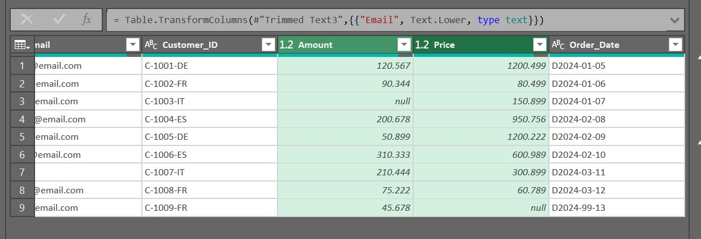</a> | <a href="screenshots/01_data_cleaning/05_financials_amount_and_price/02_amount_price_after_rounding.jpeg">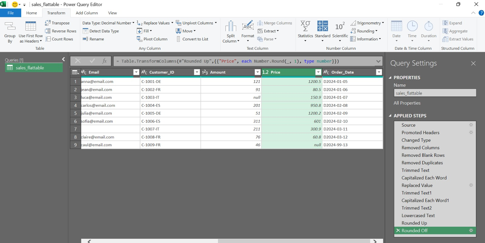</a> |

**Order Date Column**

**The Problem:** The column was stuck as text instead of a proper date, because a weird character sat at the start of every value.

<p align="center">
  <a href="screenshots/01_data_cleaning/04_order_dates/01_order_date_type_error.jpeg">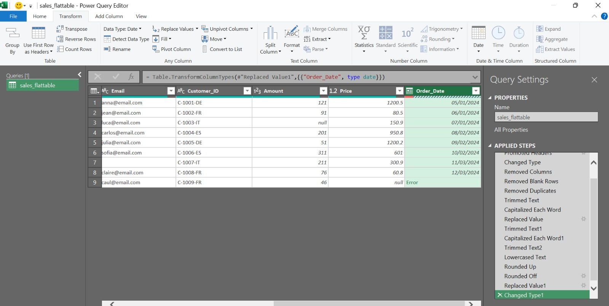</a>
  <br><em>The type error Power Query threw before the column was fixed</em>
</p>

**What I Did:** Replaced the stray character with blank, then converted the column to a proper Date type. Power Query still threw an error on the last row — the source data had "month 99," which isn't a real month.

**The decision:** rather than guess what date was intended, I treated this as a **data quality issue at the source**. The safe move is to flag it, not silently fix it — so I replaced that error with `null` instead of inventing a date.

| ❌ Before Cleaning | ✅ After Cleaning |
| :---: | :---: |
| <a href="screenshots/01_data_cleaning/04_order_dates/02_order_date_before_cleaning.jpeg">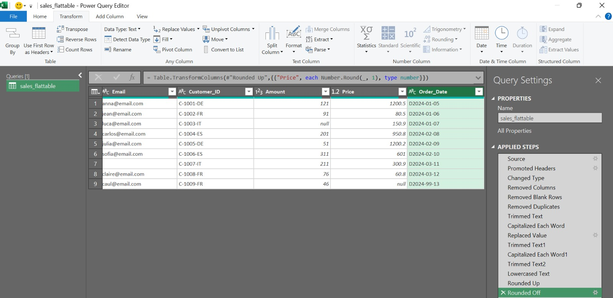</a> | <a href="screenshots/01_data_cleaning/04_order_dates/03_order_date_after_cleaning.jpeg">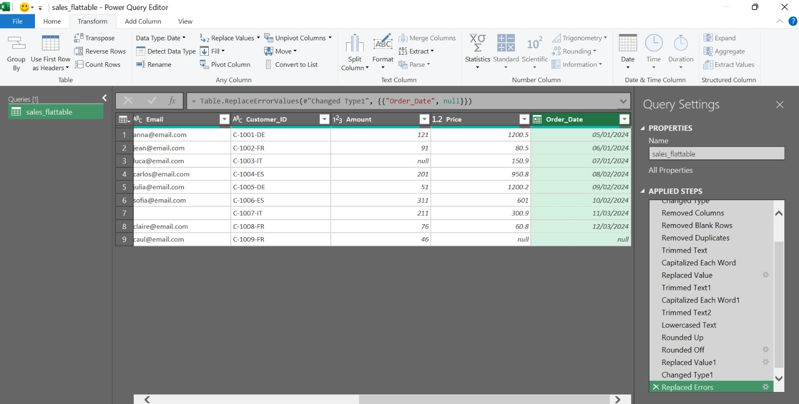</a> |

#### Step 2: Handling Missing Data
Not all "missing" data is the same, so I treated each type on its own terms:

| Type | What It Means |
| --- | --- |
| **Explicit Nulls** | A true, recognized absence of data — easy to spot and handle with standard tools like Replace Values or Fill Down |
| **Empty Strings & Whitespace** | Looks blank but is actually hidden text — Power Query treats it as valid text, which silently breaks calculations until it's trimmed |
| **Numeric Nulls** | A genuinely missing number — many calculations (like averages) ignore these, which can be misleading if not handled with care |
| **Zeros** | A valid number, but sometimes it really means "no activity happened" rather than an actual zero |

**Decisions made in this project:**
- Replaced the empty string in `Product Info` with `n/a`.
- Replaced the empty string in `Email` with `n/a`.
- **Kept nulls in `Amount`** — the business confirmed a null means the transaction hasn't happened yet, so turning it into a `0` would have incorrectly counted it in the data.
- **Replaced nulls in `Price` with `0`** — in this business context, a null price means a large discount or an item with no assigned price, so `0` accurately represents that.
- **Left nulls in `Order Date` as nulls** — rather than filling them with placeholder dates (like a "9999" date), which would distort any time-based reporting or drill-downs later on.

---

### Phase 4: Transform the Data
With the data clean, the next job is reshaping it so it's actually useful — breaking columns apart, combining others, and pulling out specific pieces of information.

**Splitting the Product Info Column**

**What I Did:** Split `Product_Info` by the `|` delimiter, producing a Product_Name column and a Category_Abbv(category abbreviation) column. The new category column had a leading space on every row — I confirmed this visually using Power Query's monospace view before trimming it. Trimming also revealed two null values (products with no category listed in the source), which I replaced with blanks. Both new columns were then renamed to reflect what they actually contain.

| ❌ Before Splitting | ✅ After Splitting |
| :---: | :---: |
| <a href="screenshots/02_data_transformation/01_splitting_product_info/01_product_info2_whitespace_before_split.jpeg">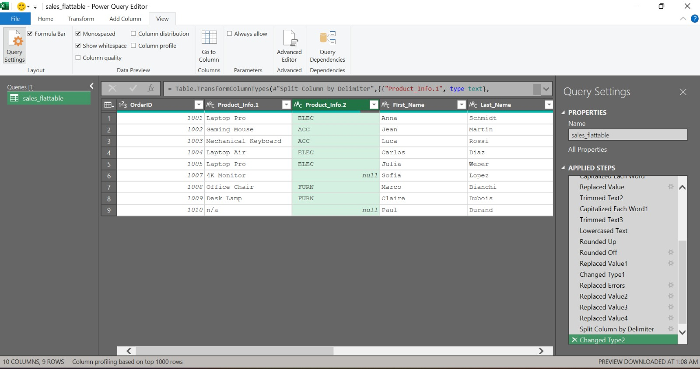</a> | <a href="screenshots/02_data_transformation/01_splitting_product_info/02_product_info2_whitespace_removed_after_split.jpeg">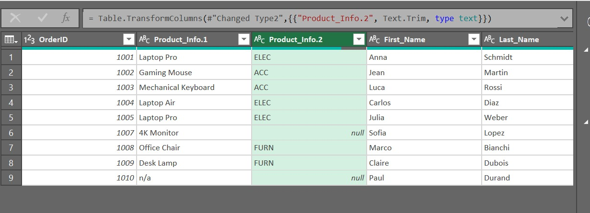</a> |

**Extracting Email Domains**

**What I Did:** Duplicated the `Email` column and extracted everything after the `@` delimiter to get the domain. Rows where the original email was missing came out blank after extraction — I replaced those with `n/a`, then renamed the new column as Email_Domain to reflect its purpose.

| ❌ Before Extracting | ✅ After Extracting |
| :---: | :---: |
| <a href="screenshots/02_data_transformation/02_extracting_email_domains/01_email_column_before_extracting_domain.jpeg">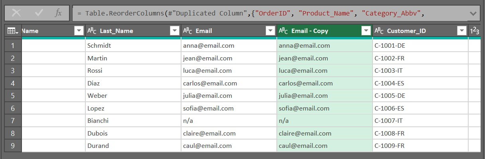</a> | <a href="screenshots/02_data_transformation/02_extracting_email_domains/02_email_column_after_extracting_domain.jpeg">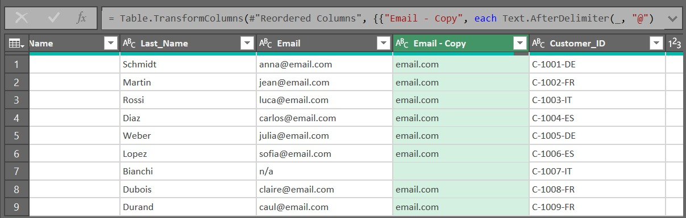</a> |

**Extracting Country Codes from Customer ID**

**What I Did:** Duplicated the `Customer_ID` column, then used Power Query's **Text After Delimiter** tool with the **"from the end of the input"** option under advanced options of "Text After Delimeter" window to pull the country code.

> **A deliberate deviation from the tutorial:** the tutorial (by Baraa) used the "Last Characters" option instead. I chose "Text After Delimiter" because it doesn't depend on knowing the country code's fixed length in advance — it's a more flexible approach for real-world data where that length could vary.

Since there was no extra spacing or other issue with the new column, I renamed it to Country_Code to reflect what it represents.

| ❌ Before Extracting | ✅ After Extracting |
| :---: | :---: |
| <a href="screenshots/02_data_transformation/03_extracting_country_codes/01_customer_id_before_extracting_country_code.jpeg">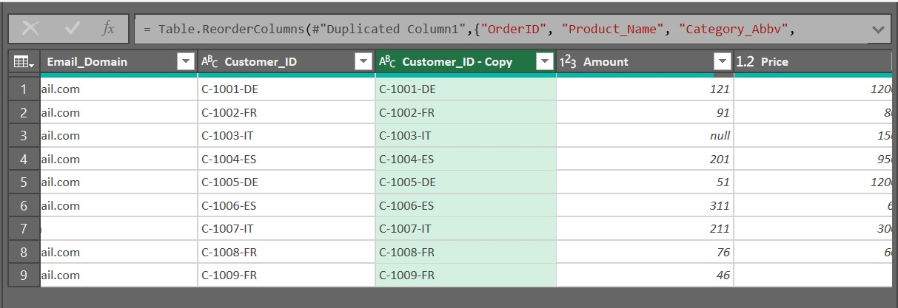</a> | <a href="screenshots/02_data_transformation/03_extracting_country_codes/02_customer_id_after_extracting_country_code.jpeg">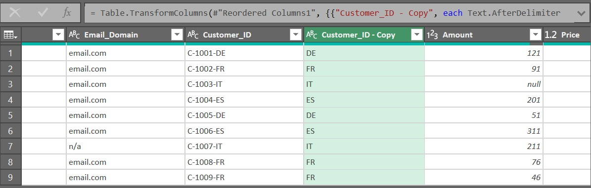</a> |

**Merging Customer Names**

**What I Did:** Combined the (now-clean) First_Name and Last_Name columns into a single `Customer_Name` column, using a space as the separator.

| ❌ Before Merging | ✅ After Merging |
| :---: | :---: |
| <a href="screenshots/02_data_transformation/04_merging_customer_names/01_customer_names_before_merging.jpeg">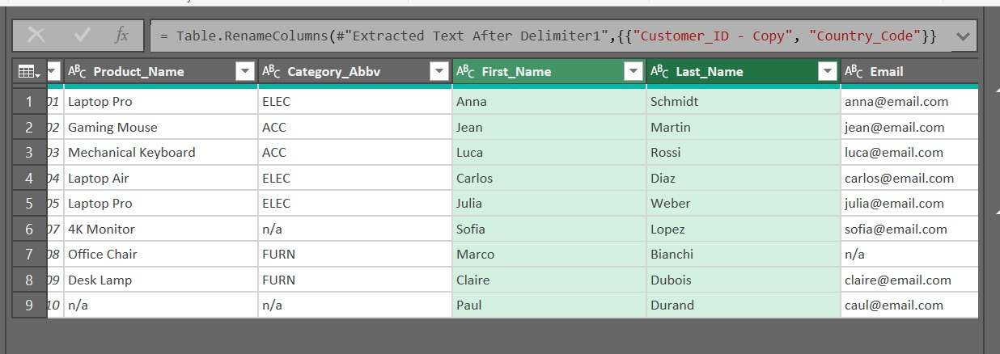</a> | <a href="screenshots/02_data_transformation/04_merging_customer_names/02_customer_names_after_merging.jpeg">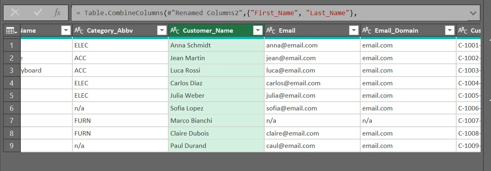</a> |

---

### Phase 5: Combine the Data

#### Step 1: Populating Category Names (Merging)
The sales data only had category **abbreviations** (like `ELEC`), not readable category names. To fix that, I built a small reference table by myself (using Power Query's **Enter Data** option) that maps each abbreviation to a full category name.

I then **merged** this new `Categories` table into the main sales table using `Category_Abbv` as the shared linking column, with a **Left Join** — so every sales row keeps its data even if a category match isn't found. After merging, I expanded the new column to show the actual category name (instead of a table link), and reordered it to sit next to `Category_Abbv`.

| 🗂️ Step A: Reference Table Created | 🔗 Step B: Merged Into Sales Table |
| :---: | :---: |
| <a href="screenshots/03_combine_data/01_populating_category_names/01_created_category_reference_table.jpeg">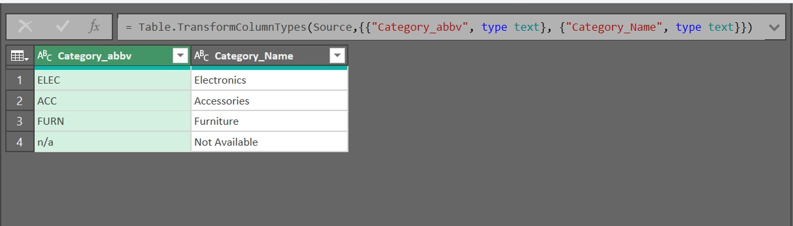</a> | <a href="screenshots/03_combine_data/01_populating_category_names/02_merged_category_names_into_sales_table.jpeg">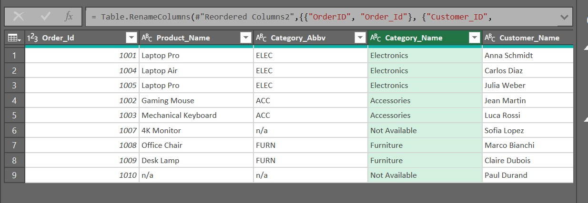</a> |

#### Step 2: Merging vs. Appending
It's worth being clear about the difference between these two, since they solve different problems:

- **Merging (Left Join)** — used above in populating category names — combines tables **side-by-side** based on a shared column. This is a core, necessary step of this project.
- **Appending** — stacks tables **on top of each other** when they share the same columns. This step isn't strictly required for the main sales table on which I am applying all steps in this project, but I demonstrated it here because it's a common real-world scenario: if you have several files sharing the same structure (like monthly order exports), you should append them into one table *before* starting ETL process — instead of wasting time applying ETL phases on each file separately.

To demonstrate this, I used two separate monthly order files:

| 📄 Orders_Jan.csv (Source) | 📄 Orders_Feb.csv (Source) |
| :---: | :---: |
| <a href="screenshots/03_combine_data/02_append_sales_queries/01_orders_jan_before_append.jpeg">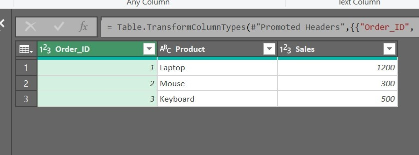</a> | <a href="screenshots/03_combine_data/02_append_sales_queries/02_orders_feb_source_data.jpeg">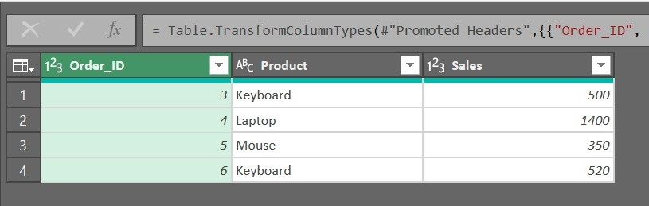</a> |

After appending the two files together, I checked for duplicate records by grouping on `Order_ID` — and found some. Since duplicate orders would inflate any sales totals, I removed them.

| ❌ After Appending (Duplicates Found) | ✅ After Removing Duplicates (Final) |
| :---: | :---: |
| <a href="screenshots/03_combine_data/02_append_sales_queries/03_appended_orders_with_duplicates.jpeg">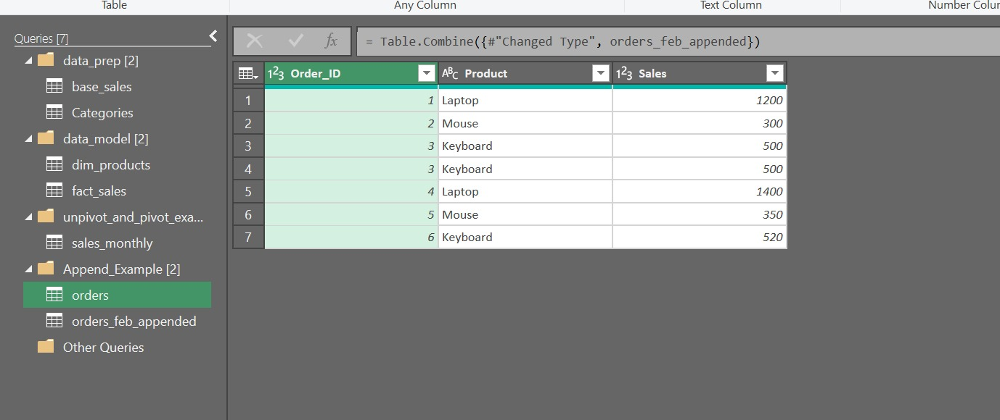</a> | <a href="screenshots/03_combine_data/02_append_sales_queries/04_final_orders_cleaned.jpeg">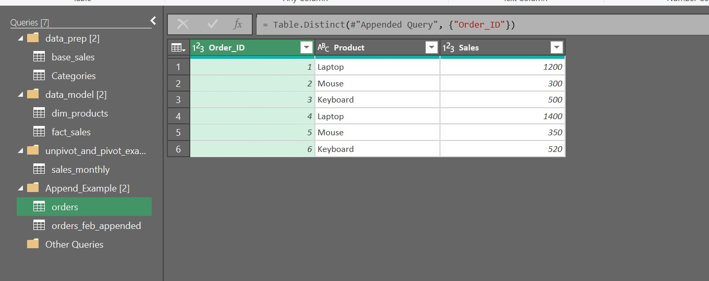</a> |

---

### Phase 6: Final Cleanup and Housekeeping

#### Step 1: Final Cleanup and Housekeeping
Before loading the data anywhere, I made sure the end result was neat and genuinely business-friendly:

- **Checked for helper columns** — reviewed every column and kept only what still added value (like the IDs still needed for merging). No leftover, irrelevant columns remained in the final table.
- **Standardized table and column names** — technical names don't mean anything to a business user, so I:
  - Renamed the main sales_flattable to a clean, capitalized name: `Sales`.
  - Fixed column names one by one for consistency — for example, `OrderID` became `Order_ID`, and a stray capital "D" in `Customer ID` was corrected to lowercase.
- **Reordered columns logically**, grouping them so the table reads naturally, left to right:
  1. **Primary Key** — `Order_ID` stays first, far left.
  2. **Products Group** — Product Name, Category, Category Name.
  3. **Customers Group** — Customer ID, Customer Name, Country Code, Email, Email Domain.
  4. **Dates and Metrics** — Order Date, then Price and Amount, kept at the far right.

#### Step 2: Reshaping the Data (Unpivot and Pivot)
Using Power Query's **Transform** tab, I reshaped the `sales_monthly` table's layout — without changing any of the underlying values.

**Unpivoting** — turning a "human-friendly" wide layout (a column per month) into an "analysis-ready" long layout (each month as its own row).

**What I Did:** Kept the Customer column fixed and selected **Unpivot Other Columns**. This moved all the month-related headers into a single `Attribute` column, with their values in a matching `Value` column. Since `Attribute` held two pieces of information at once (month *and* measure type, like "Jan Sales"), I used **Split Column by Delimiter** (splitting on the space) to separate them into clean `Month` and `Measure` columns.

| ❌ Before Unpivoting (Wide Format) | ✅ After Unpivoting & Splitting (Long Format) |
| :---: | :---: |
| <a href="screenshots/04_cleaning_up_and_housekeeping/01_unpivoting_and_pivoting_reshaping/01_sales_monthly_before_unpivoting.jpeg">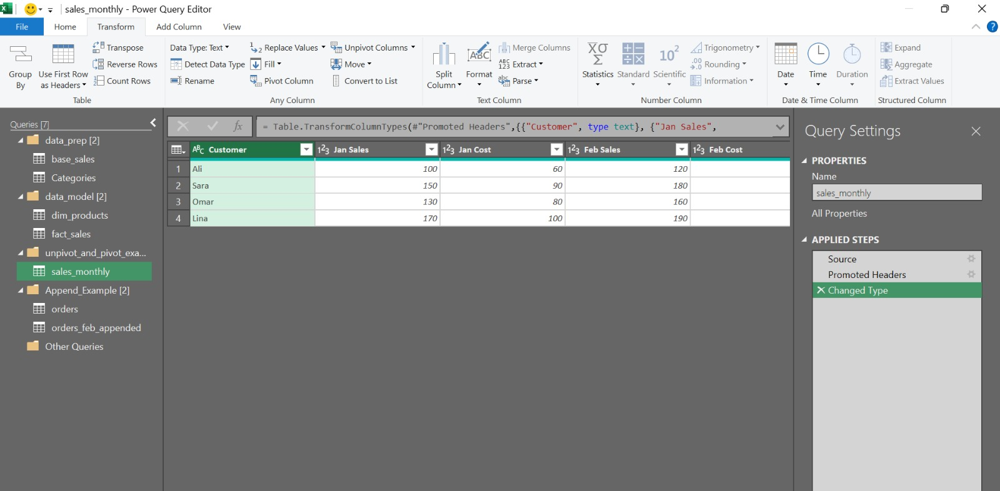</a> | <a href="screenshots/04_cleaning_up_and_housekeeping/01_unpivoting_and_pivoting_reshaping/02_sales_monthly_unpivoted_and_attribute_split.jpeg">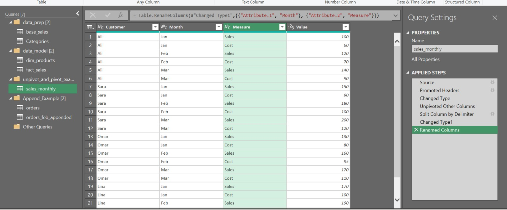</a> |

**Pivoting** — the reverse process, turning specific row values back into their own columns to make totals easier to read.

**What I Did:** Selected the `Measure` column and used **Pivot Column** option under transform tab, I set the Value column to the numeric `Value` column and chose **Sum** as the aggregation method Pivot Column window. The unique values in `Measure` (Sales and Cost) became their own column headers, with the data neatly summed underneath.

| ◀ Before Pivoting (Split Into Month/Measure) | ✅ After Pivoting (Sales & Cost as Columns) |
| :---: | :---: |
| <a href="screenshots/04_cleaning_up_and_housekeeping/01_unpivoting_and_pivoting_reshaping/02_sales_monthly_unpivoted_and_attribute_split.jpeg"></a> | <a href="screenshots/04_cleaning_up_and_housekeeping/01_unpivoting_and_pivoting_reshaping/03_final_sales_monthly_pivoted_on_measures.jpeg">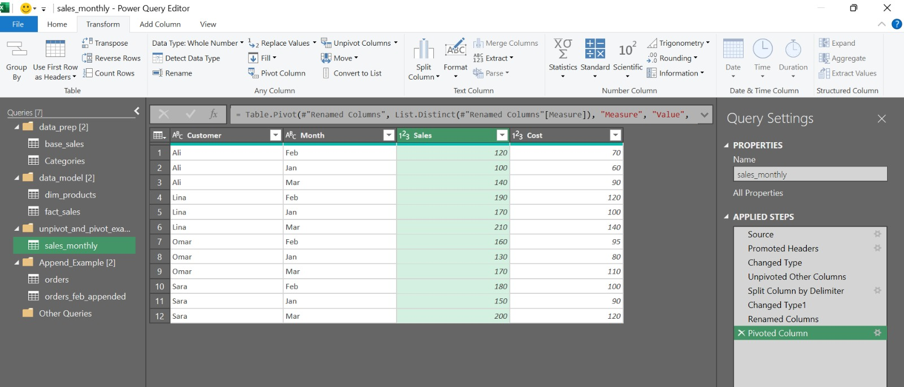</a> |

#### Step 3: Managing Queries the Real-World Way
Beyond cleaning and transforming the data itself, I organized the project the way a real analytics project should be organized:

- **Used References instead of Duplicates for the core model.** Duplicating a query creates an isolated copy that's a pain to maintain. Instead, I kept `base_sales` as the primary query — where all the general cleanup (trimming, fixing data types) happens once — and built **referenced** queries from it:
  - A `dim_products` table
  - A `fact_sales` table
  - Both had their unneeded columns removed.

  **Why this matters:** any fix made in `base_sales` automatically flows down into both the dimension and fact tables. But changes made *inside* the dimension or fact tables stay contained — they don't affect `base_sales` or each other. That's a safe, maintainable structure.

- **Organized queries into numbered folders** in the Power Query left-hand panel (like `01_Data_Prep` and `02_Data_Model`), so the project stays easy to navigate instead of turning into a wall of unlabeled queries.

<p align="center">
  <a href="screenshots/04_cleaning_up_and_housekeeping/02_final_etl_output_result.jpeg">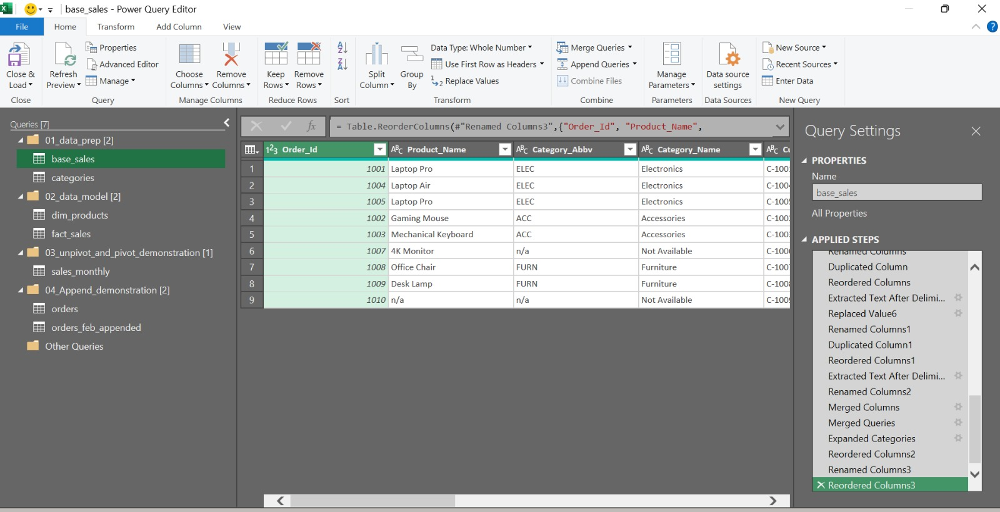</a>
  <br><em>The final, analysis-ready result — clean, well-named, and logically ordered</em>
</p>

- **Duplicating a query still usefull only for testing.** Duplicating a query is still useful — just for trying out experimental ideas without putting the original table at risk.

---

## Credits and Acknowledgments

This project was completed by following the **"Power Query Master Class for Power BI"** tutorial by data engineer **Baraa Khatib Salkini (Data With Baraa)**. Full credit goes to him for the course structure and the core Power Query techniques taught throughout it.

Where noted above (see the country code extraction step in Phase 4), I made one deliberate, documented deviation from the tutorial's exact method — chosen for its flexibility with real-world data — while staying true to the overall approach and goals taught in the course.

**Source:** "https://youtu.be/PNPenl9rLus?si=p9AM47xEf1q87XR4"

**A huge thank you to Baraa Khatib Salkini for putting together such a practical, hands-on course.**
